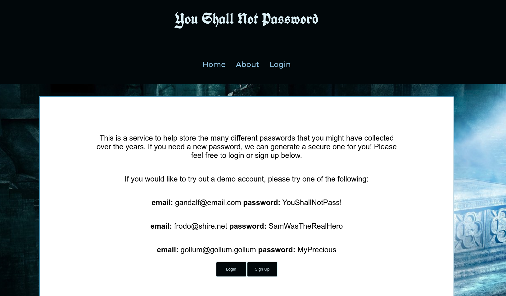
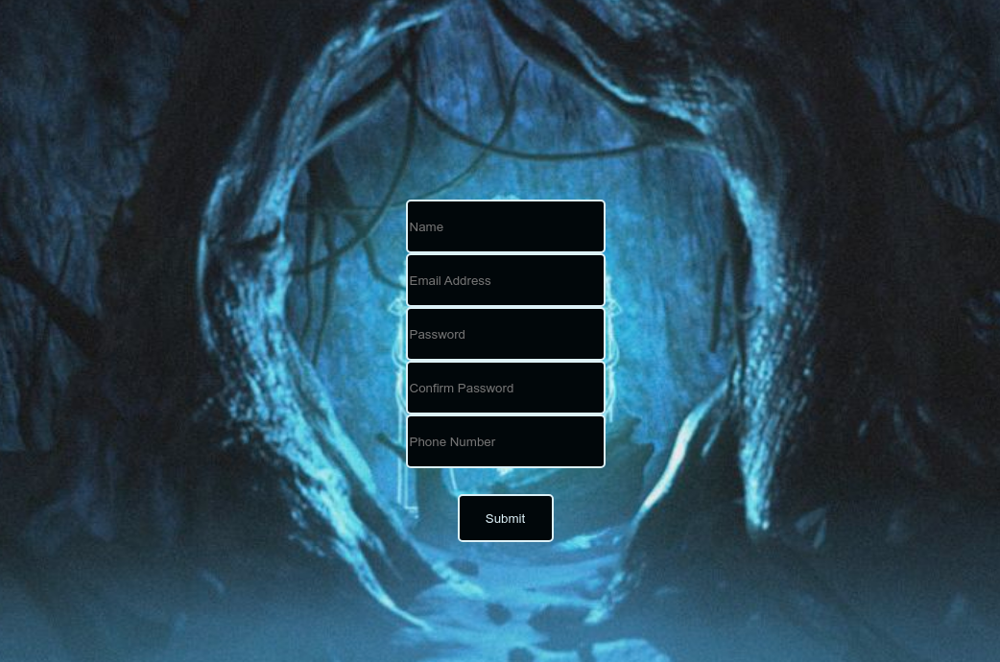
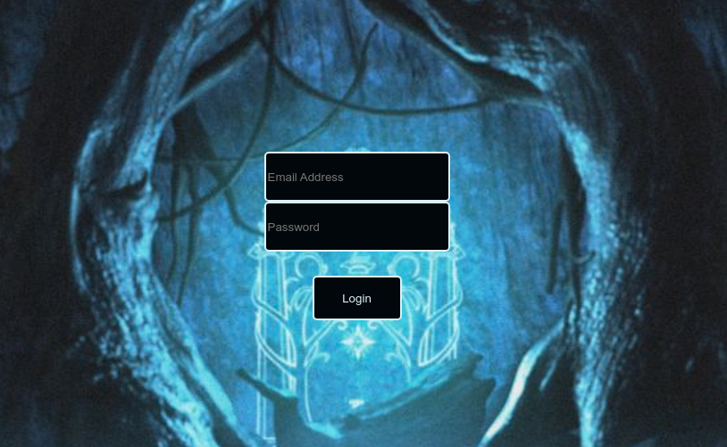
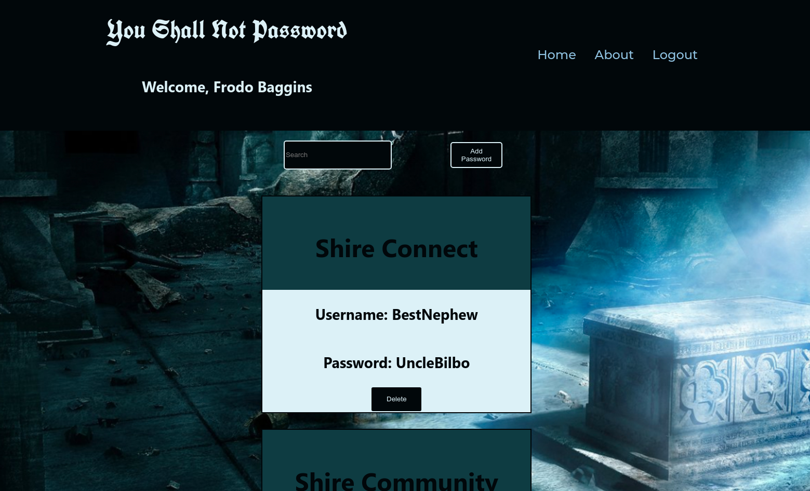
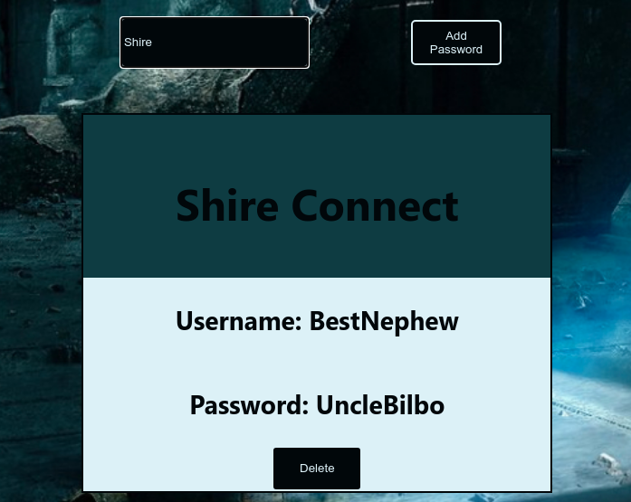
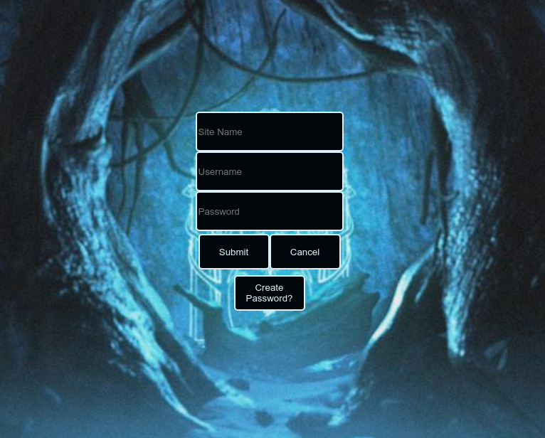
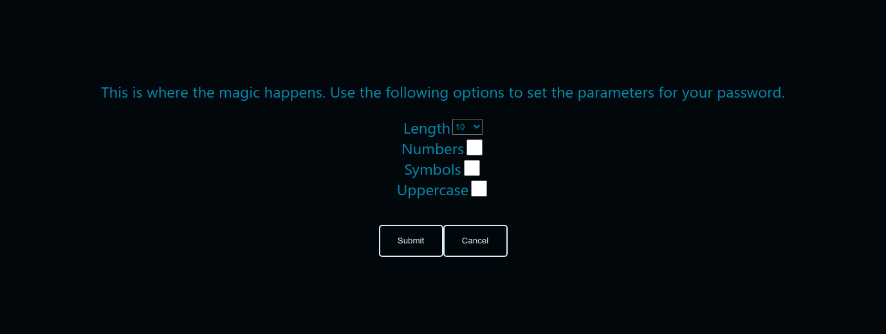
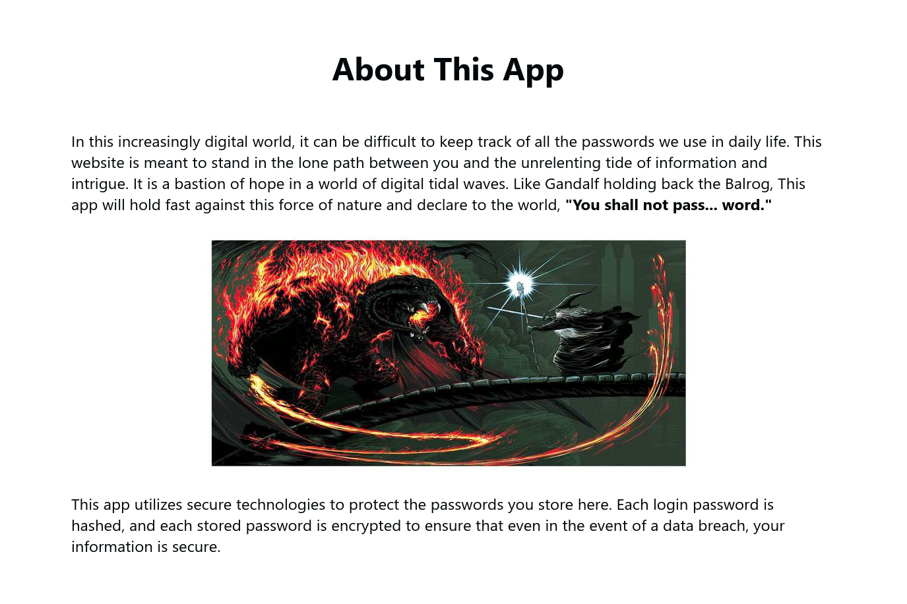

# You Shall Not Password

This is a client for a new app that helps users to keep track of passwords. The passwords stored through the app are encrpypted for security.

For information on the server-side API, click [here](https://github.com/gregjohle/you-shall-not-pass-api#readme)

## Documentation

### Landing Page

From this location, a new user can be registered, or an existing user can login with their credentials.

### Signup

A user can register for the app with this page.

### Login

With existing credentials, a user can login to the site from here.

### View Passwords

Once logged-in, a user's stored passwords will appear automatically.

### Search

With build-in search functionality, a user can search for a specific password by entering in words of phrases from the site name.

### Add a New Password

A user can use this form to add a new password to their stored passwords.

### Generate Password

A user can generate a secure password to store and use automatically. These parameters ensure almost any password requirement can be met with this generated password.

### About Page

This page provides some background and information to the user.

## Technology

This app utilizes React for the majority of the client. There are two unique npm packages used to increase the functionality of the app. React-dotenv is used to allow environment variables to hold information that should not be public, such as endpoints, secrets, and more. Generate-password is a fast and secure package that generates secure password strings with given parameters.

## Live Demo

To view this app in action, click [here](https://you-shall-not-pass-client.vercel.app/)
